# Chọn 1 trong số Font này. Tải và copy vào thư mục "~mods".

bản Launcher :
```console
\Wuthering Waves Game\Client\Content\Paks\~mods
```
bản Steam :
```console
\Wuthering Waves\Client\Content\Paks\~mods
```

## Nếu muốn font nào đó khác thì vui lòng tạo issues Gửi file font CÓ "việt hóa". Định dạng ".ttf & .otf".

# DEMO

<br>
Font GenshinFont

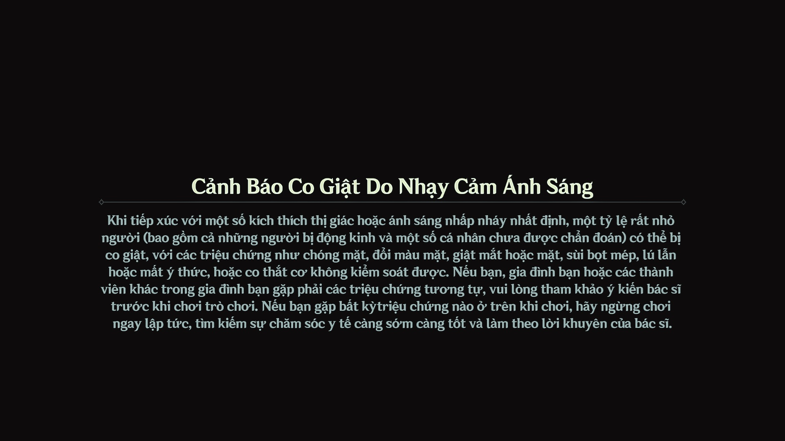

<br>
Font FixedsysExcelsior

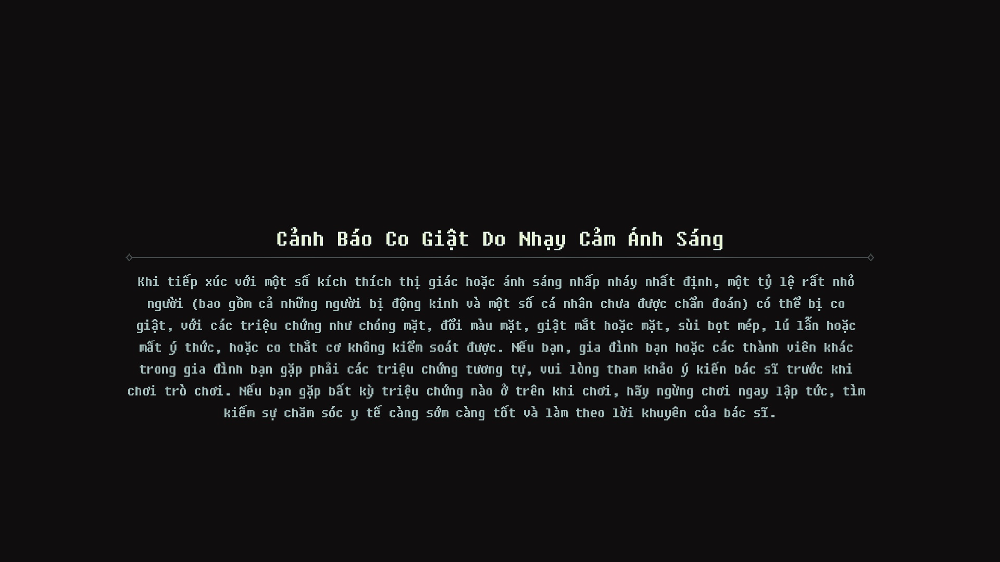

<br>
Font TSMaka-SemiboldFont

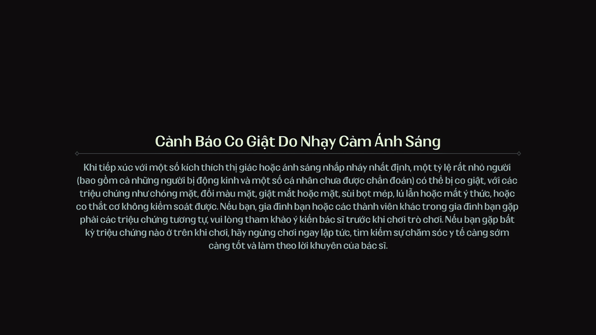

<br>
Font MontserratBold

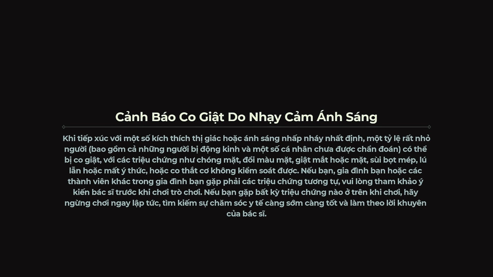

<br>
Font MontserratBoldItalic

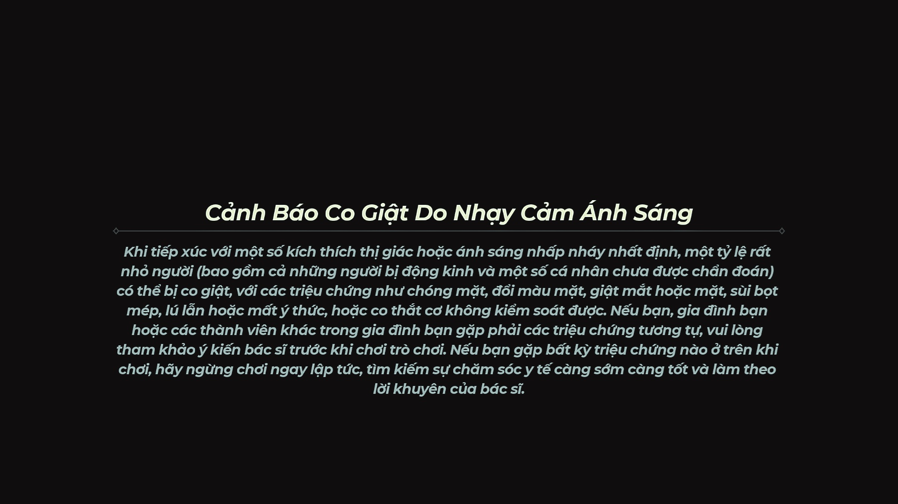

<br>
Font MontserratLight

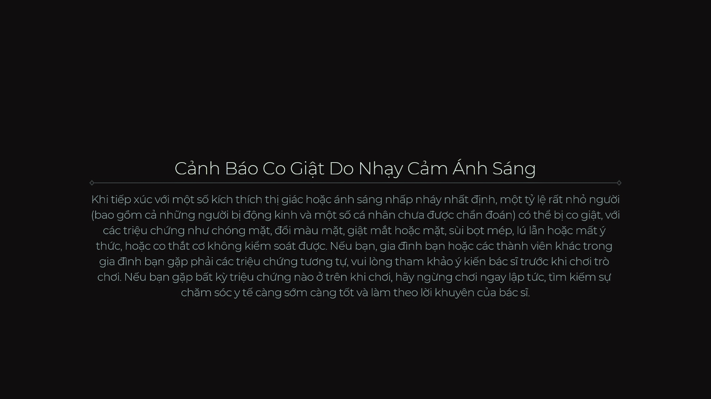

<br>
Font MontserratLightItalic

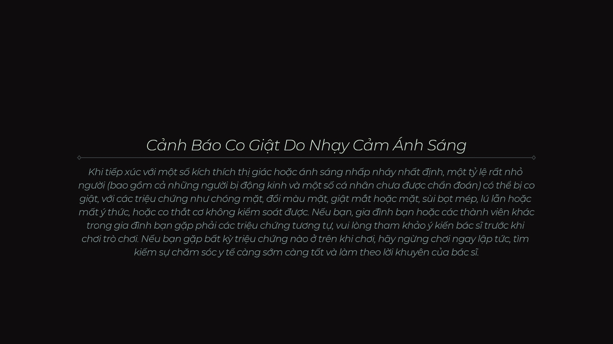

<br>
Font WixMadeforDisplayRegularFont

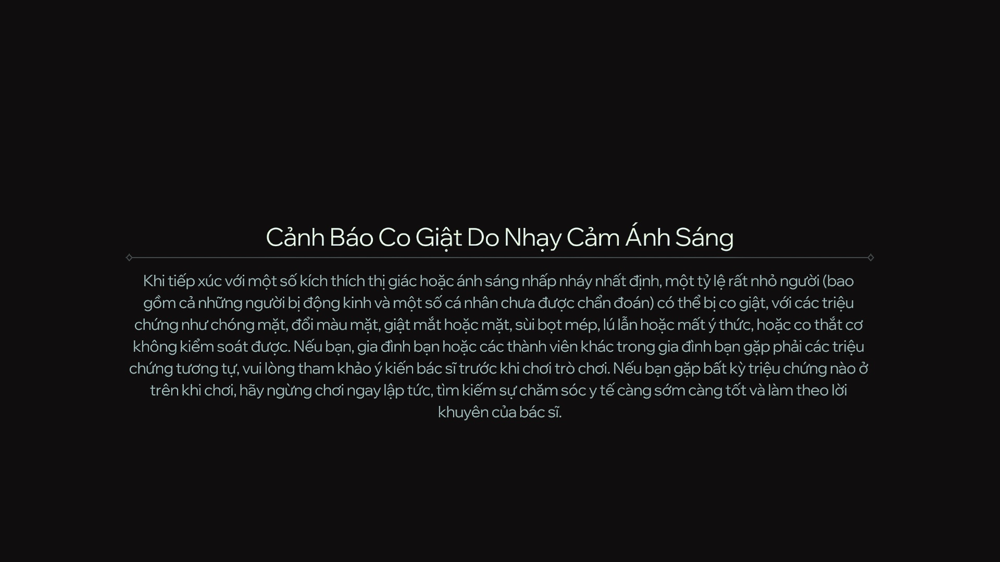

<br>
Font WuWaTechTest


<br>
Font SVN-Bali_Script

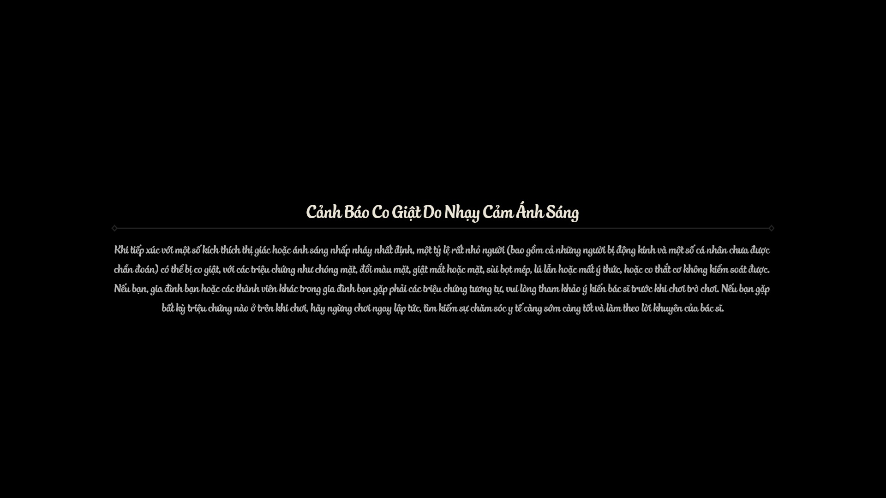

<br>
Font SVN-Beloved


<br>
Font SVN-Blenda_Script


<br>
Font SVN-Caprica_Script

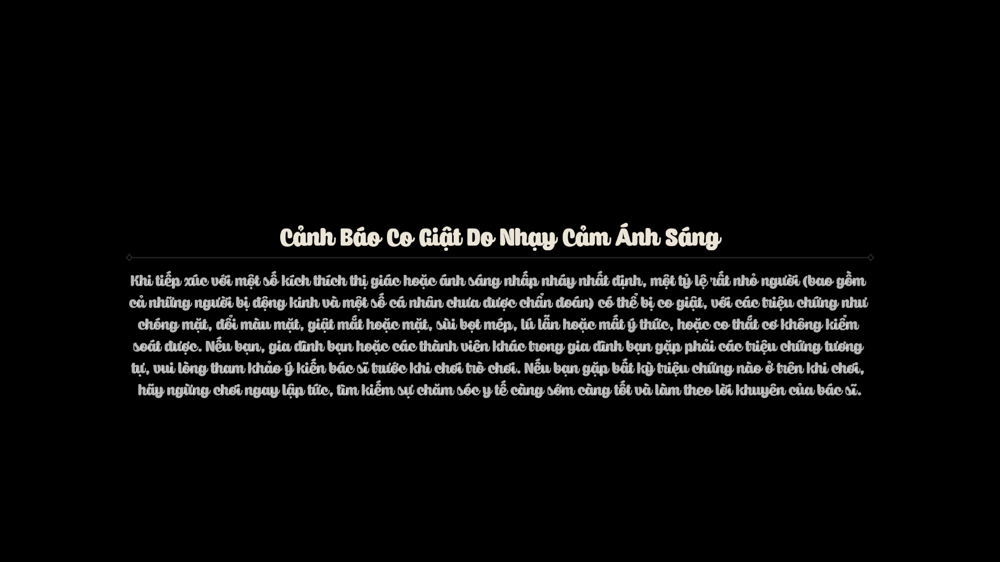

<br>
Font SVN-Clementine


<br>
Font SVN-Coco_FY


<br>
Font SVN-Franko

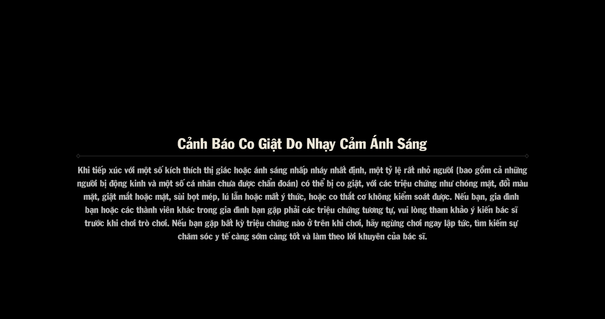

<br>
Font SVN-Genica_Pro

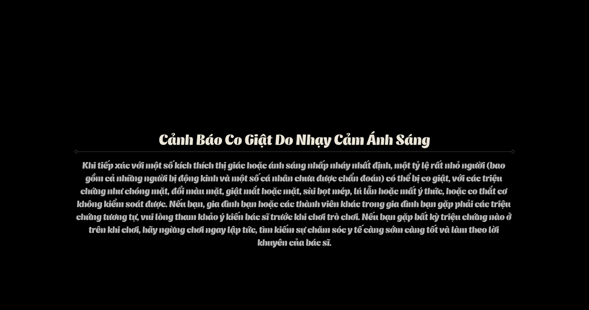

<br>
Font SVN-Hole_Hearted

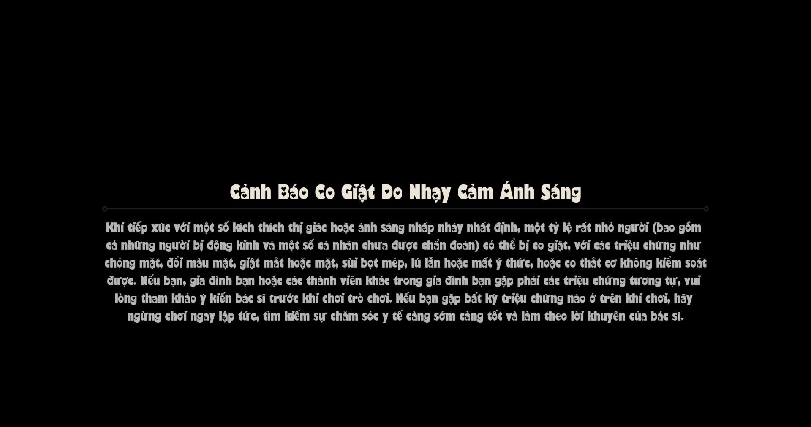

<br>
Font SVN-Internation

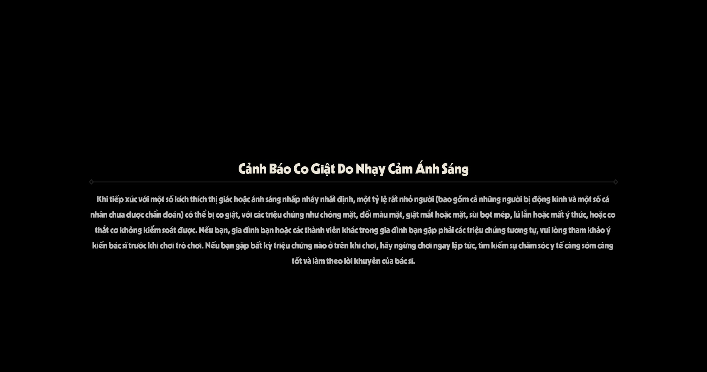

<br>
Font SVN-Larch_Shaded

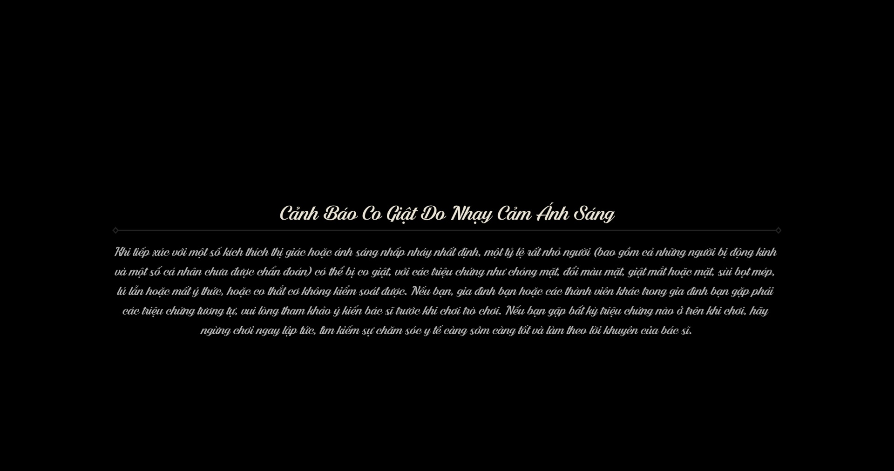

<br>
Font SVN-Lobster

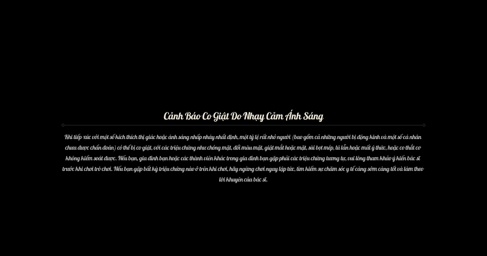

<br>
Font SVN-Monday

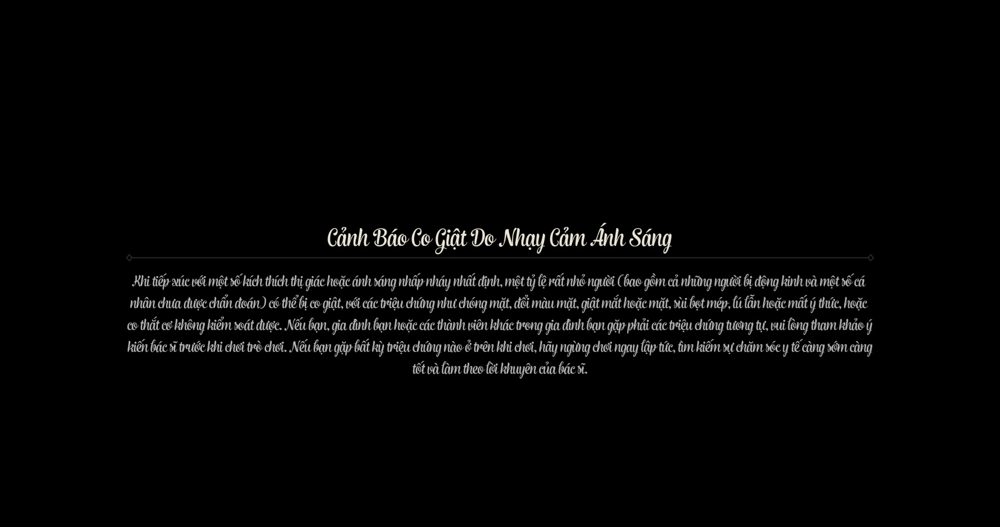

<br>
Font SVN-Steady

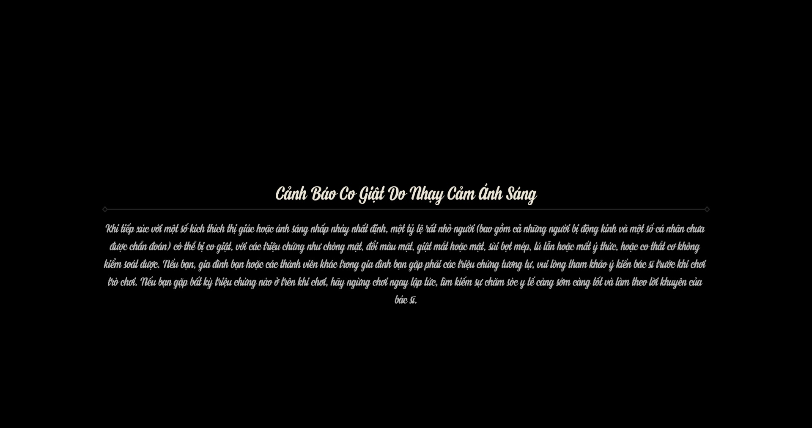

<br>
Font SVN-TradeMark

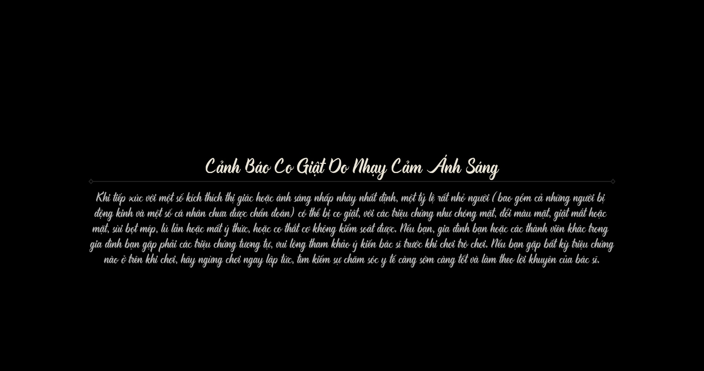
